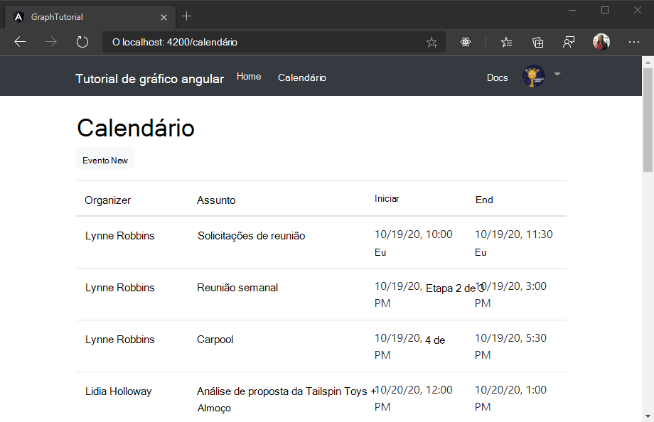

<!-- markdownlint-disable MD002 MD041 -->

Neste exercício, você incorporará o Microsoft Graph no aplicativo. Para este aplicativo, você usará a biblioteca [Microsoft-Graph-Client](https://github.com/microsoftgraph/msgraph-sdk-javascript) para fazer chamadas para o Microsoft Graph.

## <a name="get-calendar-events-from-outlook"></a>Obter eventos de calendário do Outlook

1. Adicione um novo serviço para manter todas as chamadas de gráfico. Execute o seguinte comando em sua CLI.

    ```Shell
    ng generate service graph
    ```

    Assim como o serviço de autenticação que você criou anteriormente, a criação de um serviço para isso permite que você o insira em qualquer componente que precise acessar o Microsoft Graph.

1. Quando o comando for concluído, abra **./src/app/Graph.Service.TS** e substitua o conteúdo pelo seguinte.

    ```typescript
    import { Injectable } from '@angular/core';
    import { Client } from '@microsoft/microsoft-graph-client';
    import * as MicrosoftGraph from '@microsoft/microsoft-graph-types';

    import { AuthService } from './auth.service';
    import { AlertsService } from './alerts.service';

    @Injectable({
      providedIn: 'root'
    })

    export class GraphService {

      private graphClient: Client;
      constructor(
        private authService: AuthService,
        private alertsService: AlertsService) {

        // Initialize the Graph client
        this.graphClient = Client.init({
          authProvider: async (done) => {
            // Get the token from the auth service
            let token = await this.authService.getAccessToken()
              .catch((reason) => {
                done(reason, null);
              });

            if (token)
            {
              done(null, token);
            } else {
              done("Could not get an access token", null);
            }
          }
        });
      }

      async getCalendarView(start: string, end: string, timeZone: string): Promise<MicrosoftGraph.Event[]> {
        try {
          // GET /me/calendarview?startDateTime=''&endDateTime=''
          // &$select=subject,organizer,start,end
          // &$orderby=start/dateTime
          // &$top=50
          let result =  await this.graphClient
            .api('/me/calendarview')
            .header('Prefer', `outlook.timezone="${timeZone}"`)
            .query({
              startDateTime: start,
              endDateTime: end
            })
            .select('subject,organizer,start,end')
            .orderby('start/dateTime')
            .top(50)
            .get();

          return result.value;
        } catch (error) {
          this.alertsService.addError('Could not get events', JSON.stringify(error, null, 2));
        }
      }
    }
    ```

    Considere o que esse código está fazendo.

    - Ele Inicializa um cliente do Graph no construtor para o serviço.
    - Ele implementa uma `getCalendarView` função que usa o cliente gráfico da seguinte maneira:
      - A URL que será chamada é `/me/calendarview` .
      - O `header` método inclui o `Prefer: outlook.timezone` cabeçalho, que faz com que as horas de início e de término dos eventos retornados estejam no fuso horário preferencial do usuário.
      - O `query` método adiciona os `startDateTime` `endDateTime` parâmetros e, definindo a janela de tempo para o modo de exibição calendário.
      - O `select` método limita os campos retornados para cada evento para apenas aqueles que o modo de exibição realmente usará.
      - O `orderby` método classifica os resultados por hora de início.

1. Criar um componente angular para chamar este novo método e exibir os resultados da chamada. Execute o seguinte comando em sua CLI.

    ```Shell
    ng generate component calendar
    ```

1. Depois que o comando for concluído, adicione o componente à `routes` matriz em **./src/app/app-Routing.Module.TS**.

    ```typescript
    import { CalendarComponent } from './calendar/calendar.component';

    const routes: Routes = [
      { path: '', component: HomeComponent },
      { path: 'calendar', component: CalendarComponent }
    ];
    ```

1. Abra **./src/app/Calendar/Calendar.Component.TS** e substitua seu conteúdo pelo seguinte.

    ```typescript
    import { Component, OnInit } from '@angular/core';
    import * as moment from 'moment-timezone';
    import { findOneIana } from 'windows-iana';
    import * as MicrosoftGraph from '@microsoft/microsoft-graph-types';

    import { AuthService } from '../auth.service';
    import { GraphService } from '../graph.service';
    import { AlertsService } from '../alerts.service';

    @Component({
      selector: 'app-calendar',
      templateUrl: './calendar.component.html',
      styleUrls: ['./calendar.component.css']
    })
    export class CalendarComponent implements OnInit {

      public events: MicrosoftGraph.Event[];

      constructor(
        private authService: AuthService,
        private graphService: GraphService,
        private alertsService: AlertsService) { }

      ngOnInit() {
        // Convert the user's timezone to IANA format
        const ianaName = findOneIana(this.authService.user.timeZone);
        const timeZone = ianaName!.valueOf() || this.authService.user.timeZone;

        // Get midnight on the start of the current week in the user's timezone,
        // but in UTC. For example, for Pacific Standard Time, the time value would be
        // 07:00:00Z
        var startOfWeek = moment.tz(timeZone).startOf('week').utc();
        var endOfWeek = moment(startOfWeek).add(7, 'day');

        this.graphService.getCalendarView(
          startOfWeek.format(),
          endOfWeek.format(),
          this.authService.user.timeZone)
            .then((events) => {
              this.events = events;
              // Temporary to display raw results
              this.alertsService.addSuccess('Events from Graph', JSON.stringify(events, null, 2));
            });
      }
    }
    ```

Por ora, isso apenas renderiza a matriz de eventos em JSON na página. Salve suas alterações e reinicie o aplicativo. Entre e clique no link **calendário** na barra de navegação. Se tudo funcionar, você deverá ver um despejo JSON de eventos no calendário do usuário.

## <a name="display-the-results"></a>Exibir os resultados

Agora você pode atualizar o `CalendarComponent` componente para exibir os eventos de forma mais amigável.

1. Remova o código temporário que adiciona um alerta da `ngOnInit` função. A função updated deve ter a seguinte aparência.

    :::code language="typescript" source="../demo/graph-tutorial/src/app/calendar/calendar.component.ts" id="ngOnInitSnippet":::

1. Adicione uma função à `CalendarComponent` classe para formatar um `DateTimeTimeZone` objeto em uma cadeia de caracteres ISO.

    :::code language="typescript" source="../demo/graph-tutorial/src/app/calendar/calendar.component.ts" id="formatDateTimeTimeZoneSnippet":::

1. Abra **./src/app/calendar/calendar.component.html** e substitua seu conteúdo pelo seguinte.

    :::code language="html" source="../demo/graph-tutorial/src/app/calendar/calendar.component.html" id="calendarHtml":::

Isso faz um loop pela coleção de eventos e adiciona uma linha de tabela para cada um. Salve as alterações e reinicie o aplicativo. Clique no link do **calendário** e o aplicativo agora deve renderizar uma tabela de eventos.


