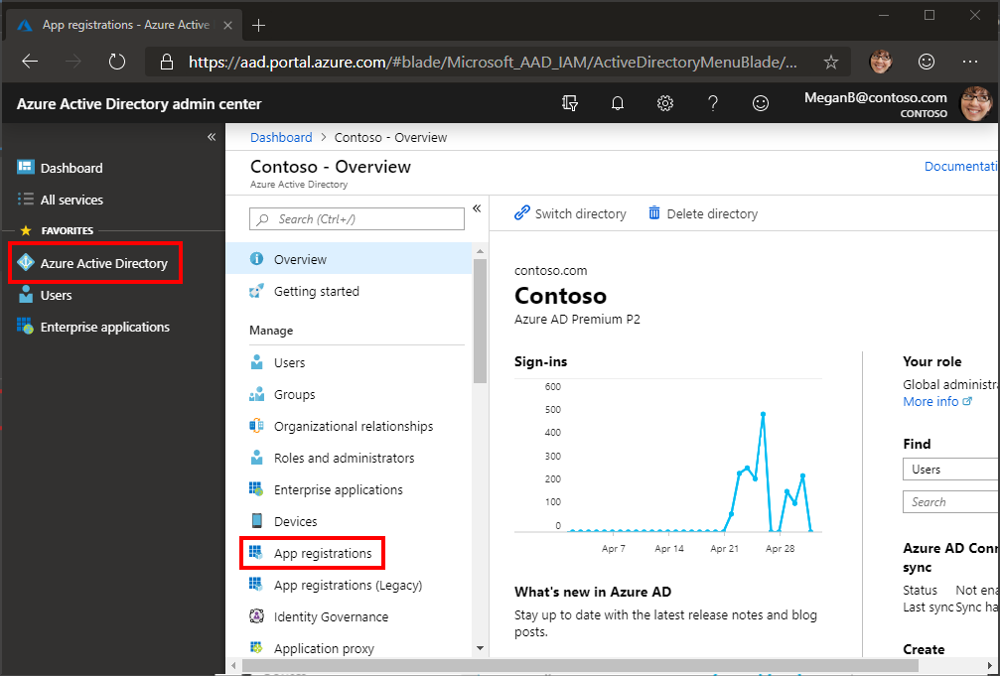

<!-- markdownlint-disable MD002 MD041 -->

Neste exercício, você criará um novo registro de aplicativo Web do Azure AD usando o centro de administração do Azure Active Directory.

1. Abra um navegador e navegue até o [centro de administração do Azure Active Directory](https://aad.portal.azure.com). Faça logon usando uma **conta pessoal** (também conhecida como Conta da Microsoft) ou **Conta Corporativa ou de Estudante**.

1. Selecione **Azure Active Directory** na navegação à esquerda e, em seguida, selecione **registros de aplicativo** em **gerenciar**.

    

1. Selecione **Novo registro**. Na página **Registrar um aplicativo**, defina os valores da seguinte forma.

    - Defina **Nome** para `Angular Graph Tutorial`.
    - Defina **Tipos de conta com suporte** para **Contas em qualquer diretório organizacional e contas pessoais da Microsoft**.
    - Em **URI de Redirecionamento**, defina o primeiro menu suspenso para `Web` e defina o valor como `http://localhost:4200`.

    

1. Escolha **Registrar**. Na página **tutorial do gráfico angular** , copie o valor da **ID do aplicativo (cliente)** e salve-o, você precisará dele na próxima etapa.

    

1. Selecione **Autenticação** em **Gerenciar**. Localize a seção **Grant implícita** e habilite tokens de **acesso** e tokens de **ID**. Selecione **Salvar**.

    
